# Bowl Chat
E2EE distributed multi platform chat system.
## Design Of Clients
### ER Diagrams
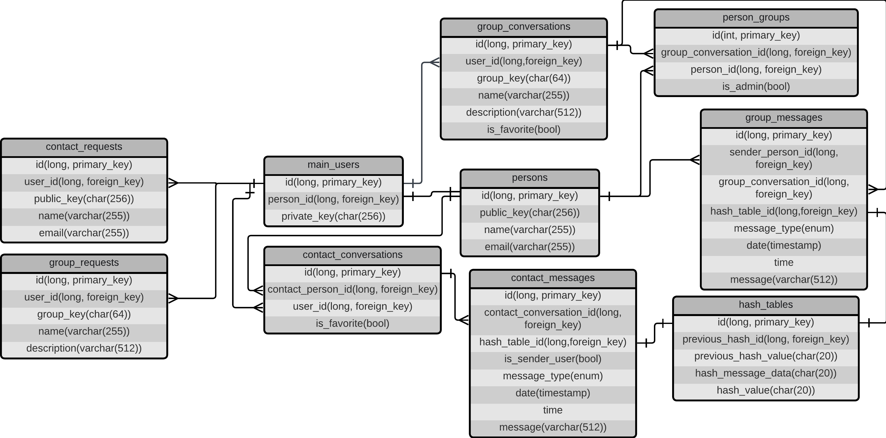
### Structure Of Hash Tables

### Calculation Of "hash_message_data"
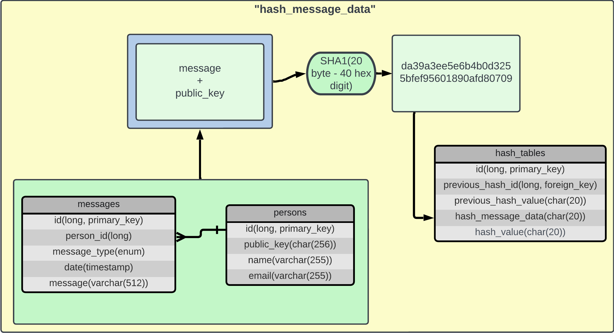
### Calculation Of "hash_value"
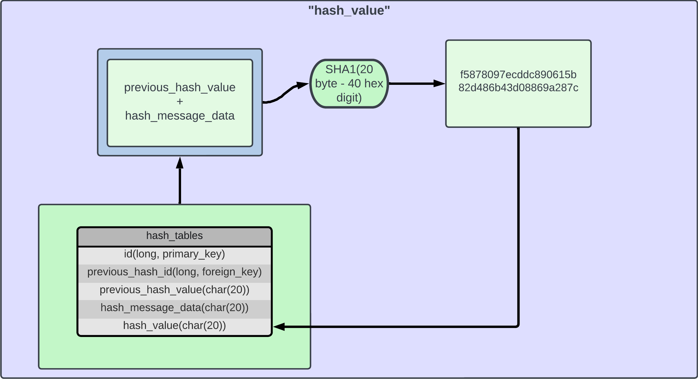
## Desktop Client
Desktop client of Bowl Chat.
### General Architecture
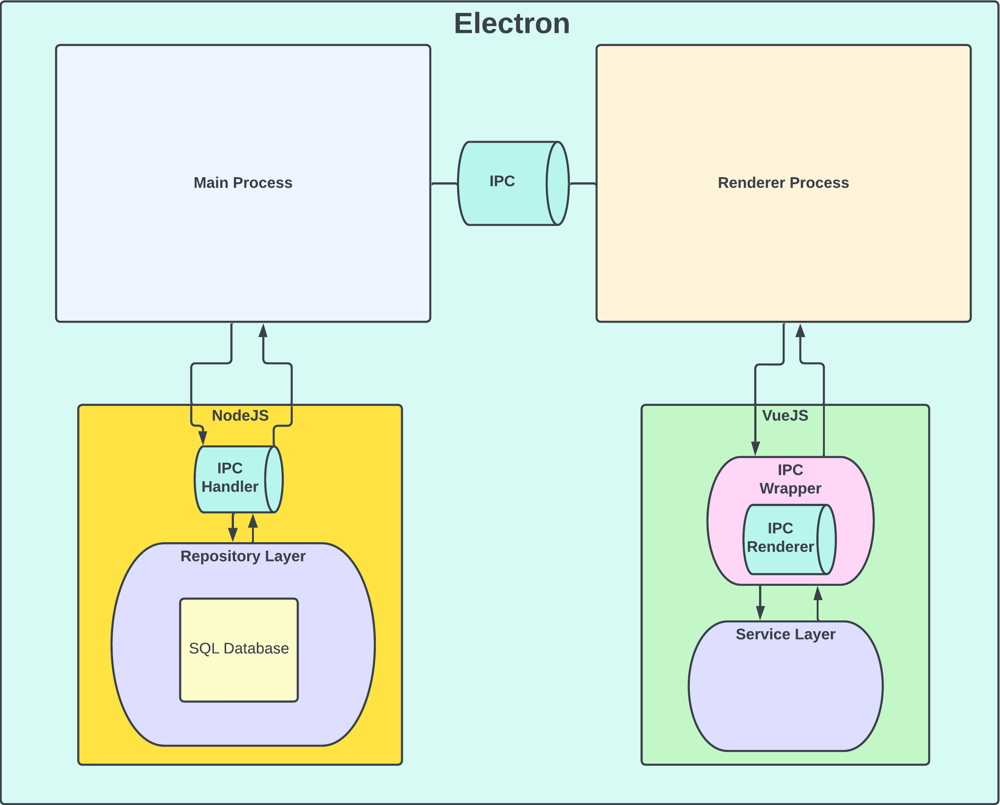
### Overview
#### Log In
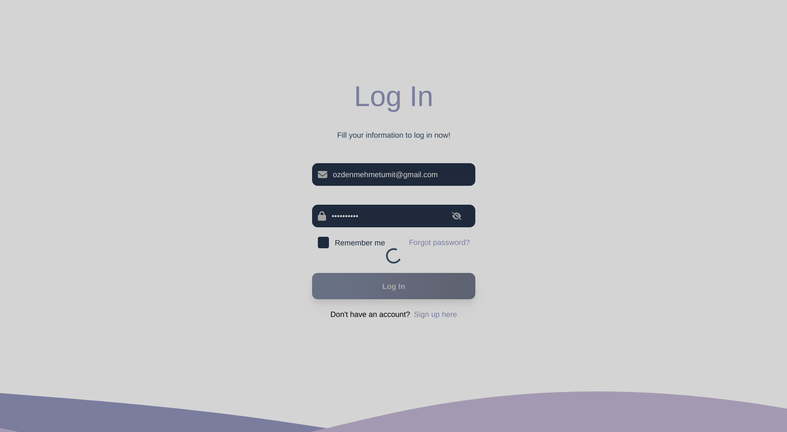
#### Add New Contact

#### Create New Group
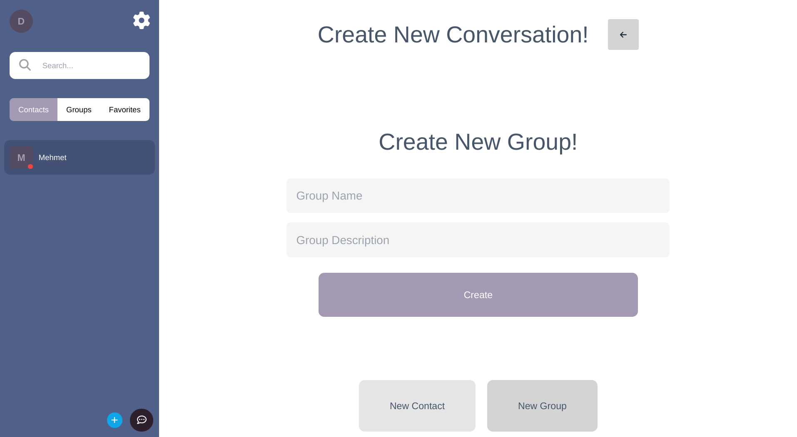
#### Add Member To Group
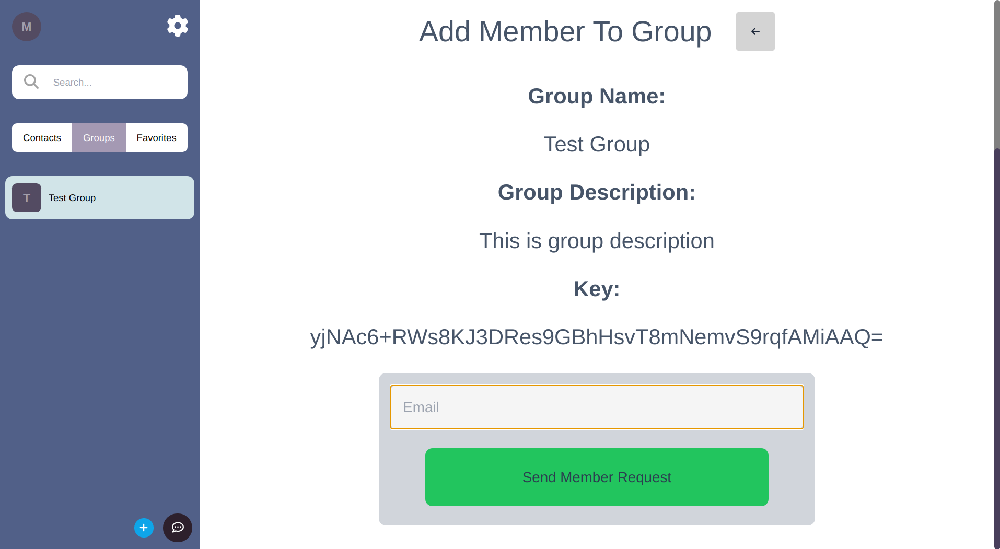
#### Notifications
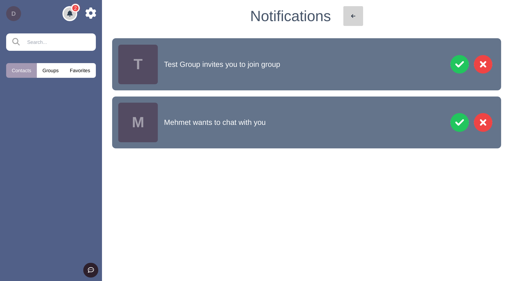
#### Chat

#### Group Info
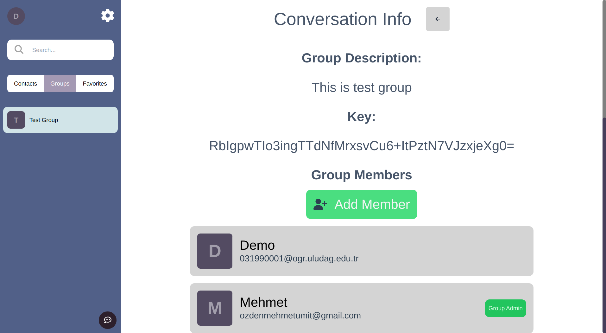
#### Settings
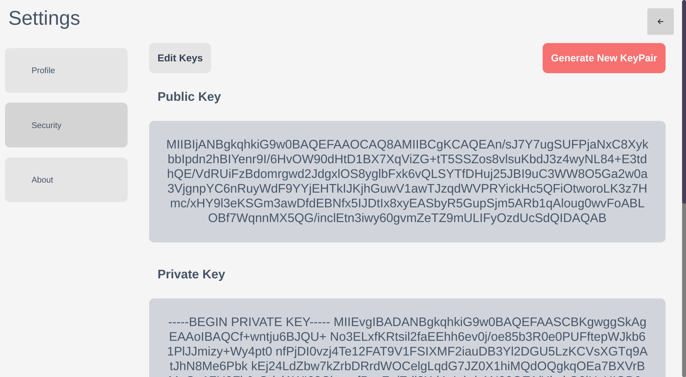
#### Generate New Key Pair
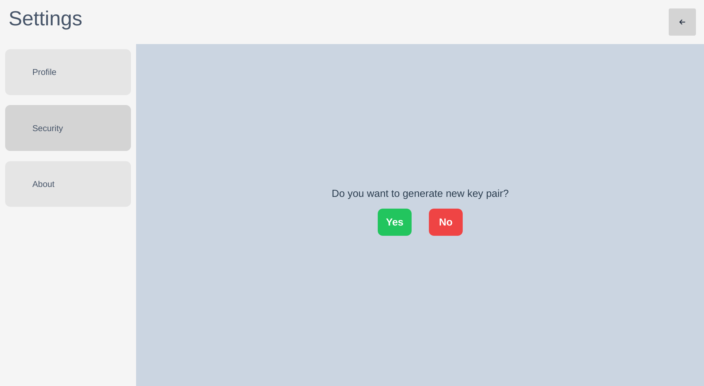
